<picture>
  <source media="(prefers-color-scheme: dark)" srcset="assets/blk/hero-dark.png">
  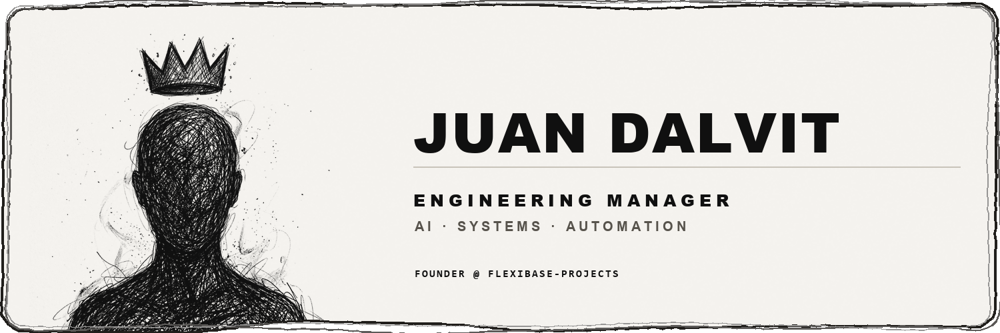
</picture>

<picture>
  <source media="(prefers-color-scheme: dark)" srcset="assets/sections/manifesto-dark.svg">
  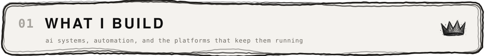
</picture>

<picture>
  <source media="(prefers-color-scheme: dark)" srcset="assets/sections/manifesto-body-dark.svg">
  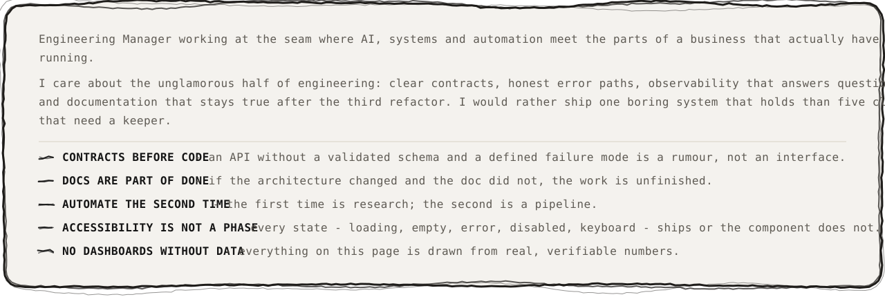
</picture>

<picture>
  <source media="(prefers-color-scheme: dark)" srcset="assets/sections/work-dark.svg">
  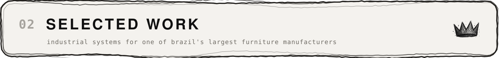
</picture>

<picture>
  <source media="(prefers-color-scheme: dark)" srcset="assets/sections/work-sso-dark.svg">
  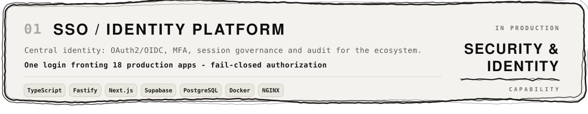
</picture>

<picture>
  <source media="(prefers-color-scheme: dark)" srcset="assets/sections/work-foccoapi-dark.svg">
  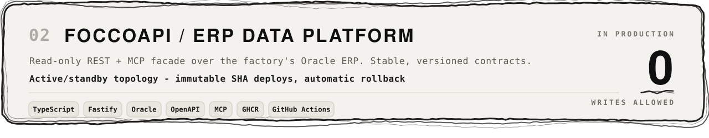
</picture>

<picture>
  <source media="(prefers-color-scheme: dark)" srcset="assets/sections/work-platform-ops-dark.svg">
  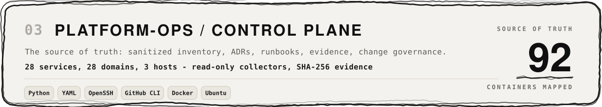
</picture>

<picture>
  <source media="(prefers-color-scheme: dark)" srcset="assets/sections/work-pmc-dark.svg">
  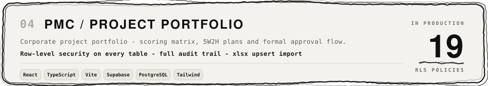
</picture>

<picture>
  <source media="(prefers-color-scheme: dark)" srcset="assets/sections/work-sgi-dark.svg">
  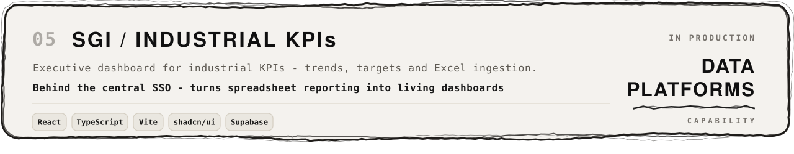
</picture>

<picture>
  <source media="(prefers-color-scheme: dark)" srcset="assets/sections/stack-dark.svg">
  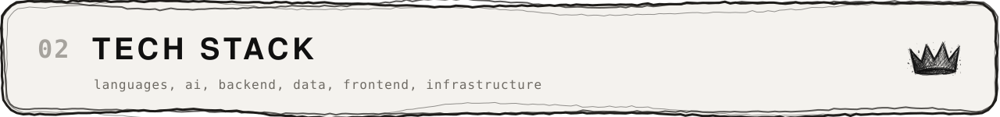
</picture>

<picture>
  <source media="(prefers-color-scheme: dark)" srcset="assets/sections/stack-grid-dark.svg">
  
</picture>

<picture>
  <source media="(prefers-color-scheme: dark)" srcset="assets/sections/signals-dark.svg">
  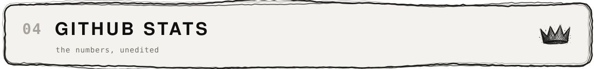
</picture>

<picture>
  <source media="(prefers-color-scheme: dark)" srcset="assets/sections/stats-dark.svg">
  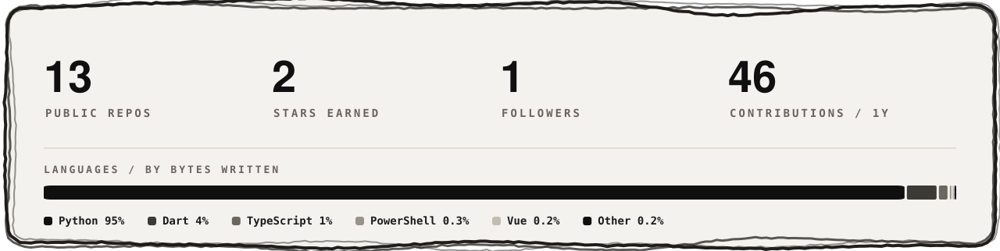
</picture>

<picture>
  <source media="(prefers-color-scheme: dark)" srcset="assets/sections/serpent-dark.svg">
  
</picture>

<picture>
  <source media="(prefers-color-scheme: dark)" srcset="https://raw.githubusercontent.com/JuanDalvit1/JuanDalvit1/output/snake-dark.svg">
  
</picture>

<picture>
  <source media="(prefers-color-scheme: dark)" srcset="assets/sections/contact-dark.svg">
  
</picture>

<a href="https://www.linkedin.com/in/juandalvit/"><picture>
  <source media="(prefers-color-scheme: dark)" srcset="assets/sections/badge-linkedin-dark.svg">
  
</picture></a> <a href="mailto:eng3.flexibase@gmail.com"><picture>
  <source media="(prefers-color-scheme: dark)" srcset="assets/sections/badge-email-dark.svg">
  
</picture></a> <a href="./assets/BLK-SYSTEM.md"><picture>
  <source media="(prefers-color-scheme: dark)" srcset="assets/sections/badge-docs-dark.svg">
  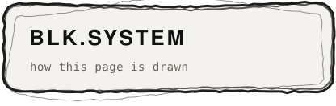
</picture></a>

<picture>
  <source media="(prefers-color-scheme: dark)" srcset="assets/blk/arise-dark.png">
  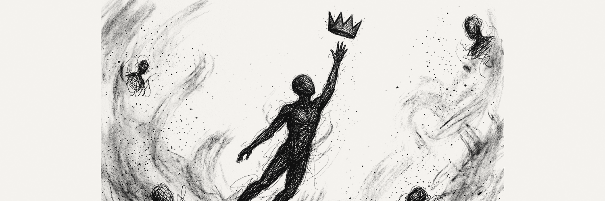
</picture>
