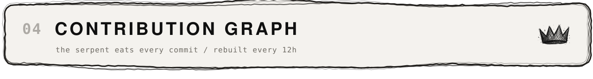
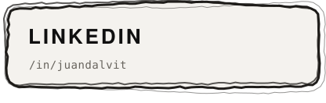

<picture>
  <source media="(prefers-color-scheme: dark)" srcset="assets/blk/hero-dark.svg">
  
</picture>

<picture>
  <source media="(prefers-color-scheme: dark)" srcset="assets/sections/what-i-build-dark.svg">
  
</picture>

<picture>
  <source media="(prefers-color-scheme: dark)" srcset="assets/sections/selected-work-dark.svg">
  
</picture>

<picture>
  <source media="(prefers-color-scheme: dark)" srcset="assets/sections/tech-stack-dark.svg">
  
</picture>

<picture>
  <source media="(prefers-color-scheme: dark)" srcset="assets/sections/serpent-dark.svg">
  
</picture>

<picture>
  <source media="(prefers-color-scheme: dark)" srcset="https://raw.githubusercontent.com/JuanDalvit1/JuanDalvit1/output/snake-dark.svg">
  
</picture>

<picture>
  <source media="(prefers-color-scheme: dark)" srcset="assets/sections/contact-dark.svg">
  
</picture>

<a href="https://www.linkedin.com/in/juandalvit/"><picture><source media="(prefers-color-scheme: dark)" srcset="assets/sections/badge-linkedin-dark.svg"></picture></a> <a href="mailto:eng3.flexibase@gmail.com"><picture><source media="(prefers-color-scheme: dark)" srcset="assets/sections/badge-email-dark.svg"></picture></a> <a href="https://dalvit.dev"><picture><source media="(prefers-color-scheme: dark)" srcset="assets/sections/badge-site-dark.svg"></picture></a>

